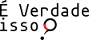

# É Verdade Isso? Plataforma para Identificação de Informações Falsas Utilizando Assinaturas de Conteúdo e IA

**Desenvolvedores:** Muriel Figueredo Franco, Eder John Scheid, Arthur Camargo  
**E-mail:** [mffranco, ejscheid, avcamargo]@inf.ufrgs.br  
**Instituição:** Universidade Federal do Rio Grande do Sul (UFRGS) - Instituto de Informática (INF) - Grupo de Redes

## Sobre o Projeto

"É Verdade Isso?" é uma plataforma desenvolvida durante a [Hackathon da Solidariedade Climática (HSClima) 2024](http://hackathon.sbc.org.br/hsclima/index.html), organizada pela [Sociedade Brasileira de Computação (SBC)](https://sbc.org.br). A hackathon foi um evento que ocorreu em resposta às enchentes devastadoras causadas pelas chuvas no Rio Grande do Sul (RS) no início de maio de 2024, onde as inscrições foram revertidas em doações.

## Resumo

Em momentos de crise, a disseminação de notícias falsas pode agravar ainda mais a situação, causando pânico, desinformação e dificultando as operações de resgate e ajuda humanitária. A plataforma "É Verdade Isso?" surge como uma iniciativa voltada para identificar e desmentir informações falsas que circulam durante desastres naturais e outras situações de emergência.

A plataforma permite que usuários façam o envio de arquivos de mídia e também textos para que seja verificado se a assinatura digital do conteúdo (i.e., hash) se encontra em alguma base como uma informação já desmentida. Para isto, a plataforma utiliza fontes de informações de páginas e veículos que atuam em combate a informações falsas e da atuação de curadores locais na plataforma para mapear informações falsas e fontes que as desmentem.

Além disso, em caso de assinaturas não existentes na base de dados, a plataforma aplica técnicas de Inteligência Artificial (IA) para verificar potenciais alterações na informação e também elementos que possam indicar desinformação (por exemplo, análise de sentimentos em textos e também verificação do uso de IA generativa para geração do conteúdo verificado).

Por fim, a plataforma "É Verdade Isso?" também serve como um agregador das principais fontes que desmentem informações falsas, facilitando assim o acesso aos usuários e também provendo uma análise das tendências de disseminação de noticias falsas durante desastres e eventos de grande repercussão.

## Como Entrar em Contato

Para mais informações, dúvidas ou sugestões, entre em contato conosco através dos e-mails dos desenvolvedores:

- Muriel Figueredo Franco: mffranco@inf.ufrgs.br
- Eder John Scheid: ejscheid@inf.ufrgs.br
- Arthur Camargo: avcamargo@inf.ufrgs.br

---

## Licença

Este projeto está licenciado sob a Licença MIT - veja o arquivo [LICENSE](LICENSE) para mais detalhes.
